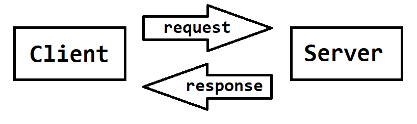
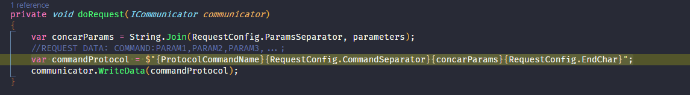
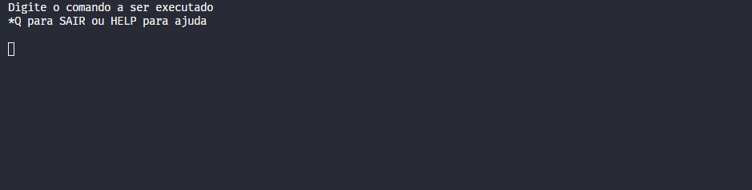
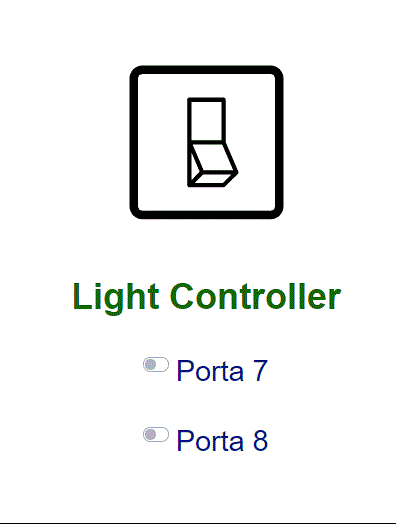
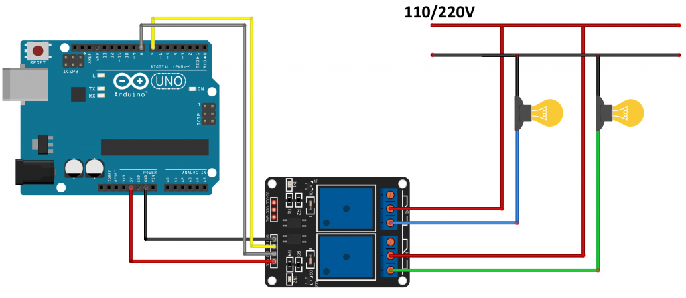

# Light Controller

Light Controller is a sample project demonstrating how to control a lamp via terminal and serial protocol.

## Protocol Overview

The protocol is based on a serial connection, where a microcontroller acts as a server and exchanges messages with a client machine through the serial interface.

Message exchange works as follows:
- The client sends a request to the microcontroller (server).
- The server processes the request.
- The server responds with the result of the request processing.



### Request Message Format

Request messages follow this model:
```
[COMMAND]:[PARAM_0],[PARAM_1],...,[PARAM_N];
```
Where:
- `COMMAND`: The name of the command to execute.
- `PARAM_*`: Input parameters for the command (the number of parameters depends on the command).

Important:
- The semicolon (`;`) marks the end of the command.
- The colon (`:`) separates the command name from its parameters.
- The comma (`,`) separates command parameters.

### Response Message Format

Response messages follow this model:
```
[STATUS]:[MESSAGE];
```
Where:
- `STATUS`: The status of the request processing: `S` for success or `E` for error.
- `MESSAGE`: Information about the status.

Important:
- The semicolon (`;`) marks the end of the response.
- The colon (`:`) separates the status from the message.

### List of Supported Commands

#### Turn On Output
```
ON:[PortNumber];
```
Turns on the output specified by the parameter.
Example: Turn on output 7: `ON:7;`


#### Turn Off Output
```
OFF:[PortNumber];
```
Turns off the output specified by the parameter.
Example: Turn off output 7: `OFF:7;`



#### Get Output Status
```
GET:[PortNumber];
```
Returns the status of the specified output. `1` means on, `0` means off.
Example: Request status of output 7: `GET:7;`
Response: `S:1;`

#### Get All Outputs Status
```
GETALL:;
```
Returns the status of all outputs.
Example: Request all outputs: `GETALL:;`
Response (outputs 7 and 8 are off): `S:7=0,8=0;`

## Command Line Interface (CLI)

One way to use the protocol is through the Command Line Interface (CLI). The CLI abstracts the protocol and provides user-friendly commands.



### CLI Commands

- `help`
- `turnOn [PortNumber]`
- `turnOff [PortNumber]`
- `get [PortNumber]`
- `getAll`

## Web Interface (REST Server + Web Page)

You can also use the protocol via a web page, which provides a simple and intuitive user experience.



## Arduino Implementation

The Arduino implementation is straightforward. Use a relay module, the code in the `light.receiver` folder, and assemble the circuit as shown below:



Example of operation:


## Project Structure

- `light.controller/`: Core logic and protocol implementation.
- `light.controller.CLI/`: CLI application for controlling the lamp.
- `light.controller.WebAPI/`: REST API and web server.
- `light.controller.front/`: Frontend web application (Vue.js).
- `light.receiver/`: Arduino code for the microcontroller.

## How to Run

1. **Arduino**: Upload the code from `light.receiver/` to your Arduino and connect the relay module.
2. **Backend**: Build and run the .NET backend (`light.controller.WebAPI/`).
3. **Frontend**: Start the Vue.js frontend (`light.controller.front/`).
4. **CLI**: Use the CLI app in `light.controller.CLI/` for terminal control.

## References
- [Arduino Serial Communication](https://www.embarcados.com.br/arduino-comunicacao-serial/)
- [Relay Module Control with Arduino](https://www.filipeflop.com/blog/controle-modulo-rele-arduino/)
- [Bootstrap Input Group](https://getbootstrap.com/docs/4.0/components/input-group/)
- [Vue + TypeScript Tutorial](https://blog.logrocket.com/vue-typescript-tutorial-examples/)
- [YouTube Tutorial Series](https://www.youtube.com/watch?v=TSX_hMfL13U&list=PLQCmSnNFVYnTiC-pPY0SySbf-ZNGBwnaG)
